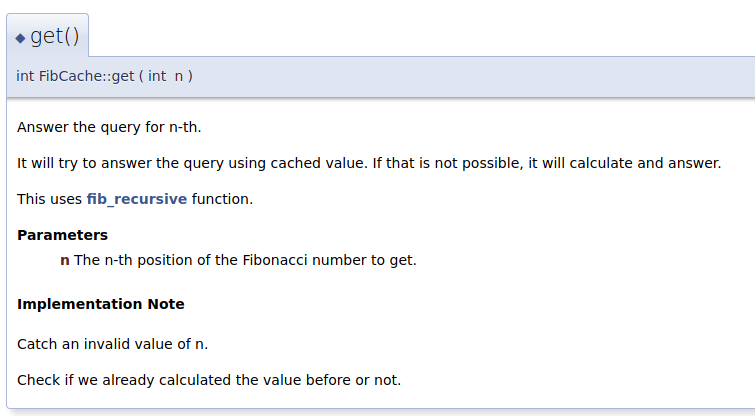
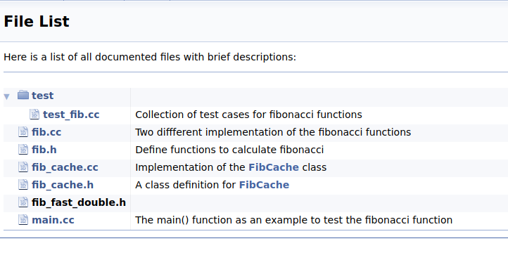
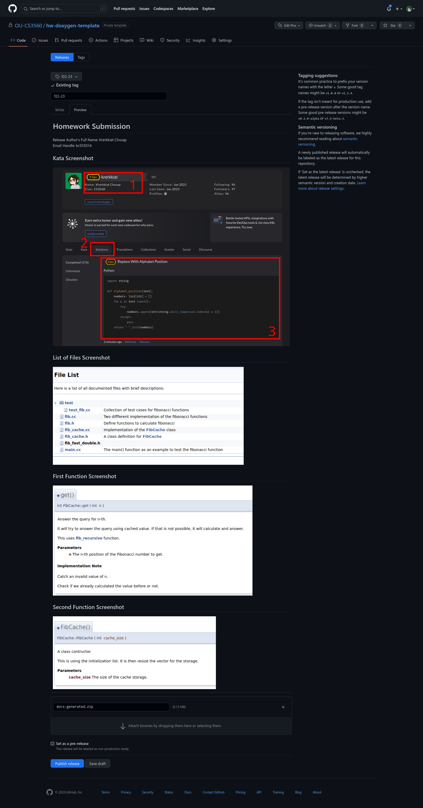
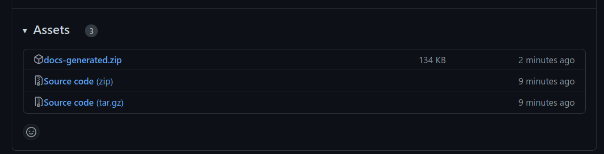

<h2 align="center">
CS3560 Homework Assignment: Documentation Tools (Doxygen) (100 Points)<br/>
Due date: Please see the due date on Blackboard 
</h2>

The purpose of this assignment is to put GitHub, Git, Make, and Source Code Documentation Tools to use in a small project.

## Step 1 - Setup your tool

Install [Doxygen](https://www.doxygen.nl/) and configure it for the given project. You must

- Set the name of the project to be your full name and email handle (e.g. `Krerkkiat Chusap (kc555014@ohio.edu)`).
- Set the output directory to `docs-generated` in the root of the repository.
- Turn off LaTeX source file generation.
- Tell doxygen that `dot` program is not available.

Consult the [Doxygen's documentation](https://www.doxygen.nl/manual/index.html) or a search engine.

## Step 2 - Modify Makefile

Each tool will have its own command to generate the documentation file. Modify the given `Makefile` so that
running the command `make doc` will generate documentation using the tool you picked. Running `make doc` again
should not generate the documentation again unless the source files are changed.

## Step 3 - Document the source code

**Write Documentation for functions**

Document **four** functions from any of the following classes: `game`, `Othello`, `piece`. The documentation for each of the function should include

- Description of the function on what it does.
- The return type of the function should be documented.
- The name, type and short description of the arguments of the function (if there is any) should be documented.
- You must properly use at least one [Doxygen's special commands](https://www.doxygen.nl/manual/commands.html).

- At least three unique commands should be used across four functions.

**Write Documentation for a file**

Convert the comment at the begining of `source/piece.hpp` to a Doxygen's documentation.

## Step 4 - Tagging a commit

Once you are done documenting your functions, please tag your latest commit with a tag name `DocReady`. Please make sure that this tag is pushed to the repository on GitHub.

## Step 5 - Prepare for the submission

### Step 5.1 - Taking screenshots

- Generate the documentation using `make doc`. Create a zip file of the folder `docs-generated` that is located
  at the root of the repository. If such folder is not there, please check your tool's configuration.
- Take one screenshot for each of the
  function you documented. Example of one of the screenshots can be seen below. For Doxygen, to
  take the screenshot, you can open `docs-generated/html/index.html` file in your browser. Then click on `Classes` then the class (or classes) where your two functions are in.

  

  (this screenshot does not show the description of the return value).

- Take another screenshot of `docs-generated/html/files.html` when it is opened in a browser. The
  example of this screenshot is shown below.

  

### Step 5.2 - Creating a release on GitHub

Next, we will be creating a release on the repository on GitHub. Please read through the two articles to
get general ideas on GitHub Releases.

- [About releases](https://docs.github.com/en/repositories/releasing-projects-on-github/about-releases)
- [About release management](https://docs.github.com/en/repositories/releasing-projects-on-github/managing-releases-in-a-repository#about-release-management)

Then create a release using your tag you created earlier in step 5. Give the release the same name as your tag.
In the description of the release use the following template

```plain
# Homework Submission

Release Author's Full Name: <YOUR_FULL_NAME>
Email Handle: <YOUR_EMAIL_HANDLE>

## List of Files Screenshot

<UPLOAD_YOUR_FIRST_SCREENSHOT_HERE>

## First Function Screenshot

<UPLOAD_YOUR_FIRST_SCREENSHOT_HERE>

## Second Function Screenshot

<UPLOAD_YOUR_SECOND_SCREENSHOT_HERE>
```

Attach the zip file of the generated documentation as assets of the release. Don't forget to replace `<YOUR_FULL_NAME>`, `<YOUR_EMAIL_HANDLE>` with actual values. Also don't forget to upload your screenshots. For example, of how the release should look like please see Appendix E. Once the release is created, take note of its URL for submission.

## Submission

Submit on Blackboard, a link to your release on GitHub.

## Appendix A - Doxygen Installation

The installation process is sligthly different depending on your operating system / environment. These sections are just the summary of the information found in the [Doxygen's manual](https://www.doxygen.nl/manual/install.html)

### Linux and GitHub Codespaces

Doxygen can be installed from package manager with a command `sudo apt-get install doxygen`.

### macOS

There are three options to install Doxygen on macOS.

#### Install from source code

You will need CMake for this, and you can follow the instruction in [Compiling from source on UNIX](https://www.doxygen.nl/manual/install.html#install_src_unix).

#### Install using homebrew

The command `brew install doxygen` should do the job. You will need to have brew installed. Visit https://brew.sh/ for how to install it.

#### Install with dmg file

The dmg file can be downloaded from https://www.doxygen.nl/download.html (under "A binary distribution for Mac OS X 10.14 and later" of the "Sources and Binaries" section).

To install it, drag the folder from the dmg installation page into the `Applications` folder on your macOS.
Then you should be able to double click the application for a GUI. You can also use the doxygen via a command
line by using `/Applications/Doxygen.app/Contents/Resources/doxygen` instead of just `doxygen`.

To run it with just `doxygen`, you need to add `/Applications/Doxygen.app/Contents/Resources` to your 
environment variable named `PATH`. This can be done by the following command `export PATH=$PATH:/Applications/Doxygen.app/Contents/Resources/`.

This `export` command, however, will not be persistent. To make a persistent change you can add the command to
your shell start-up script file (typically `~/.zshrc`).

If the above step does not work, please let the TA know. The TA who updates this instruction does not have Mac device, so it may not be accurate.

### Windows

You can download a precompiled binary from https://www.doxygen.nl/download.html. You will need to update environment variable name `PATH` so that a path to your installation  (It will be somewhere in `C:\Program Files\doxygen\bin`) is included. Consult a search engine on how to modify your `PATH` environment variable on Windows.

## Appendix B - Documentation Tools

| Language             | Tool          |
| -----------          | -----------   |
| C/C++                | Doxygen       |
| Python               | Sphinx        |
| C#                   | Doxygen       |
| JavaScript / Node.js | jsdoc         |
| Rust                 | rustdoc       |

## Appendix C - Example of a Release

Example of release (right click and open image in new tab for the full image)



Example of assets where `docs-generated.zip` contain the generated files.



## Appendix D - Rubric

Total Points: 100 points

### Weekly Assignemnt (100 points)

The weekly assignemnt can be broken down into three sections. The minimum score students can get from each section is 0. Any section with score below 0 should be set to 0.

#### GitHub Release (20 points)

- (+20) A release is created with a zip file of generated documentation listed as asset. This release should be unique to this student only. Two or more students should not be using the same release.
- (-5) If the zip file is not attached to the release. This serves as a proof that students know how to run doxygen to generate the documentation. They also know where the output is.
- (-5) If the release does not have the two required screenshots. This mean that TA will have to manually open up the `index.html` to check if the function is documented properly or not.

#### Documentation (80 points)

**Function Documentation**

(15 points/function)

- (+5) Uses the correct style of comment.
- (+5) Adds the description of the function.
- (+5) Uses at least two "command".

**File Documentation**

- (+10) The file-level documentation for `source/piece.hpp` render properly.

**Overall Docs**

- (+5) Properly use at least 3 uniques Doxygen special commands.

**Makefile**

- (+5) Running `make doc` create HTML documentation in `docs-generated/` folder at the root of the repository.

**Miscs**

- (-5) If the generated documentation files are showing up in the repository.
